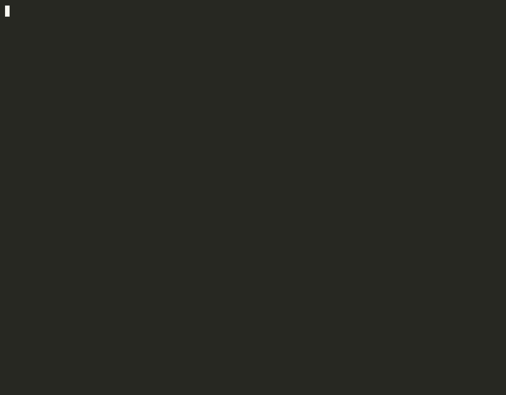

# agentgrade

[](https://pypi.org/project/agentgrade/)
[](https://pypi.org/project/agentgrade/)
[](LICENSE)
[](https://github.com/agentgrade/agentgrade/actions/workflows/ci.yml)

**Pytest for multi-agent systems.**

> Most frameworks help you build agents. agentgrade helps you stop them from silently getting worse.

agentgrade is a local-first CLI + GitHub Action that runs regression tests on AI agent
workflows, traces failures, and assigns **credit** across agents/tools/handoffs.

The headline feature: **when an agent workflow fails, agentgrade tells you _which_ agent,
tool, or handoff likely caused the failure** — and suggests a deterministic prompt patch
to fix it.



## Why this exists

Eval dashboards tell you *that* your agents regressed; they rarely tell you *who* did it.
agentgrade is built for the inner loop of multi-agent development: it runs offline and
deterministically in CI like a unit-test suite, traces every named agent/tool step, and
pins each failed check on the specific agent that caused it — then emits a copy-pasteable
prompt patch. No dashboard to host, no API key to manage, no vendor lock-in: just
`agentgrade test` next to `pytest` in your pipeline.

- Local-first, framework-agnostic, no vendor lock-in.
- No required API key — works with any plain Python callable.
- Fully deterministic, offline-friendly.
- Terminal UI only (no dashboard), beautiful and copy-pasteable output.

## Security model / trust boundary

> [!IMPORTANT]
> **agentgrade imports and runs the Python code referenced by your
> `agentgrade.yaml`.** Loading the agent `entrypoint` and every module listed
> under `plugins:` executes that code in your process. Treat `agentgrade test`
> /`record` exactly like running that code directly.

- **Only run agentgrade against code you trust.** Pointing it at a config whose
  entrypoint or plugins you did not write is equivalent to running arbitrary
  code from that source.
- **Do NOT run it on untrusted pull requests from forks.** In CI, use the
  `pull_request` trigger on trusted/same-repo branches only — never
  `pull_request_target`, and never against fork PRs. The bundled
  `.github/workflows/agentgrade.yml` sets `permissions: contents: read` and
  carries this warning.
- On every run agentgrade prints a one-line stderr warning naming the module(s)
  it is about to import. Set `AGENTGRADE_NO_WARN=1` to silence it; this does not
  change what is imported.
- **Regex checks (ReDoS):** `regex` checks and inferred-credit regex matching
  run patterns from your (trusted) config against agent output. A maliciously
  crafted pattern can backtrack catastrophically; agentgrade caps the searched
  output length and guards against invalid patterns, but you should still avoid
  running untrusted regex patterns.

## Table of contents

- [Install](#install)
- [Security model / trust boundary](#security-model--trust-boundary)
- [Quickstart](#quickstart)
- [Demo](#demo)
- [How it works](#how-it-works)
- [Example config](#example-config)
- [Example output](#example-output)
- [Deterministic CI with record/replay](#deterministic-ci-with-recordreplay)
- [Machine-readable output (`--json`)](#machine-readable-output---json)
- [CLI commands](#cli-commands)
- [Evaluators](#evaluators)
- [Custom evaluators (plugin API)](#custom-evaluators-plugin-api)
- [Inferred credit (no annotations required)](#inferred-credit-no-annotations-required)
- [LangGraph](#langgraph)
- [GitHub Action](#github-action)
- [Development](#development)
- [Contributing](#contributing)
- [License](#license)

## Install

```bash
pip install agentgrade
```

Or from source:

```bash
pip install -e .
```

Requires Python >= 3.10.

## Quickstart

```bash
agentgrade init                 # create an example agentgrade.yaml
agentgrade test                 # run your agent tests
agentgrade improve --suggest    # get a deterministic prompt patch from failures
```

Or point at one of the bundled examples:

```bash
agentgrade test --config examples/simple_agent/agentgrade.yaml
```

## Demo


The bundled `simple_agent` is a scripted **Coder → Critic** pipeline that deliberately
ships an incomplete DDP script. Running it fails the reward threshold and names the
culprits (exit code `1`, so CI fails the build).

> The demo above is a committed, self-hosted recording — no external host. Re-render it
> from the checked-in [`assets/demo.cast`](assets/demo.cast) with
> `agg assets/demo.cast assets/demo.gif`, or regenerate the whole thing with
> `bash scripts/demo.sh`. A static, dependency-light SVG version lives at
> [`assets/demo.svg`](assets/demo.svg).

<details>
<summary>Copy-pasteable example output (text fallback)</summary>

```text
$ agentgrade test --config examples/simple_agent/agentgrade.yaml
╭────────── FAIL  ddp_training_script  reward=0.60 (threshold 0.75) ───────────╮
│ ┏━━━━━━━━━━━━━━━━━━━━━━━━━━━━┳━━━━━━━━┳━━━━━━━━┳━━━━━━━━━━━━━━━━━━━━━━━━━━━┓ │
│ ┃ Check                      ┃ Result ┃ Weight ┃ Detail                    ┃ │
│ ┡━━━━━━━━━━━━━━━━━━━━━━━━━━━━╇━━━━━━━━╇━━━━━━━━╇━━━━━━━━━━━━━━━━━━━━━━━━━━━┩ │
│ │ contains:DistributedSampl… │  fail  │    0.2 │ output is missing         │ │
│ │                            │        │        │ 'DistributedSampler'      │ │
│ │ contains:DistributedDataP… │  pass  │    0.2 │ output contains           │ │
│ │                            │        │        │ 'DistributedDataParallel' │ │
│ │ contains:init_process_gro… │  pass  │    0.2 │ output contains           │ │
│ │                            │        │        │ 'init_process_group'      │ │
│ │ regex:torchrun|python -m   │  fail  │    0.2 │ output does not match     │ │
│ │ torch.distributed.run      │        │        │ /torchrun|python -m       │ │
│ │                            │        │        │ torch.distributed.run/    │ │
│ │ max_latency                │  pass  │    0.1 │ latency 210ms <= 30000ms  │ │
│ │ max_cost                   │  pass  │    0.1 │ cost $0.0070 <= $1.00     │ │
│ └────────────────────────────┴────────┴────────┴───────────────────────────┘ │
╰──────────────────────────────────────────────────────────────────────────────╯
╭─────────────────────────── Root cause candidates ────────────────────────────╮
│ • CoderAgent: output is missing 'DistributedSampler'                         │
│ • CriticAgent: output does not match /torchrun|python -m                     │
│ torch.distributed.run/                                                       │
╰──────────────────────────────────────────────────────────────────────────────╯
╭─────────────────────────── Suggested prompt patch ───────────────────────────╮
│ + [CoderAgent] Ensure the output includes `DistributedSampler`.              │
│ + [CriticAgent] Ensure the output matches the pattern `torchrun|python -m    │
│ torch.distributed.run` (e.g. include a launch command).                      │
╰──────────────────────────────────────────────────────────────────────────────╯
╭───────────────────────────── agentgrade summary ─────────────────────────────╮
│ 0/1 tests passed                                                             │
╰──────────────────────────────────────────────────────────────────────────────╯
JSON: .agentgrade/results/latest.json
Markdown: .agentgrade/reports/latest.md
```

</details>

## How it works

Your "agent" is any Python callable `f(input: str) -> (final_output: str, AgentTrace)`.
Inside it, record a step for each named agent/tool using the bundled `TraceRecorder`:

```python
from agentgrade.integrations import TraceRecorder

def run_agent(task: str):
    rec = TraceRecorder(test_name="ddp_training_script")
    draft = coder_agent(task)
    rec.step("CoderAgent", input=task, output=draft, latency_ms=120, cost_usd=0.004)
    reviewed = critic_agent(draft)
    rec.step("CriticAgent", input=draft, output=reviewed, latency_ms=90, cost_usd=0.003)
    return reviewed, rec.finalize(final_output=reviewed)
```

Because each step carries a distinct `agent_name`, agentgrade can blame the agent
responsible for a failed check.

## Example config

`examples/simple_agent/agentgrade.yaml`:

```yaml
agent:
  type: python
  entrypoint: examples.simple_agent.agent:run_agent

tests:
  - name: ddp_training_script
    input: "Write a PyTorch DDP training script."
    checks:
      - type: contains
        value: "DistributedSampler"
        weight: 0.2
        agent_name: CoderAgent
      - type: contains
        value: "DistributedDataParallel"
        weight: 0.2
        agent_name: CoderAgent
      - type: contains
        value: "init_process_group"
        weight: 0.2
        agent_name: CoderAgent
      - type: regex
        value: "torchrun|python -m torch.distributed.run"
        weight: 0.2
        agent_name: CriticAgent
      - type: max_latency
        seconds: 30
        weight: 0.1
      - type: max_cost
        usd: 1.0
        weight: 0.1

settings:
  fail_below_reward: 0.75
  output_dir: ".agentgrade"
```

The `agent_name` metadata on each keyword check is what lets credit assignment point at a
specific agent.

## Example output

The bundled `simple_agent` is a scripted **Coder → Critic** pipeline that deliberately
ships an incomplete DDP script (the `CoderAgent` forgets `DistributedSampler`, and neither
agent adds a `torchrun` launch command). Running it fails the reward threshold and names
the culprits (see [Demo](#demo) above for the full panel).

The process exits non-zero (`1`) so CI fails the build. Results are written to
`.agentgrade/results/latest.json` and `.agentgrade/reports/latest.md`.

### Suggested patch

`agentgrade improve --suggest` reads the last failed run and emits a copy-pasteable patch
(no LLM calls — pure deterministic heuristics):

```text
$ agentgrade improve --config examples/simple_agent/agentgrade.yaml --suggest
# Suggested prompt patch for `ddp_training_script`

Append the following checklist items to the responsible agent prompts:

## CoderAgent

```diff
  Before returning your answer, verify:
+ - [ ] Ensure the output includes `DistributedSampler`.
```

## CriticAgent

```diff
  Before returning your answer, verify:
+ - [ ] Ensure the output matches the pattern `torchrun|python -m torch.distributed.run` (e.g. include a launch command).
```
```

Compare against `examples/ddp_coding_agent`, a more complete pipeline that emits all
required elements and **passes** (`reward=1.00`).

## Deterministic CI with record/replay

Real LLM agents are nondeterministic, so running them live in CI flakes. agentgrade can
record a single real run and then **replay** it deterministically and offline:

```bash
# 1. Record once: runs the real agent and saves each test's trace as a fixture.
agentgrade record --config examples/simple_agent/agentgrade.yaml
# -> writes .agentgrade/fixtures/<test_name>.json

# 2. Replay forever: no agent import/call, fully deterministic, identical reward + credit.
agentgrade test --config examples/simple_agent/agentgrade.yaml --replay
```

In replay mode the runner never imports or calls the real agent entrypoint — it loads
the saved `AgentTrace` fixture and re-runs the checks, credit assignment, and patch
suggestions against it. Enable it per-run with `--replay`, or persistently in config:

```yaml
settings:
  replay: true
  fixtures_dir: ".agentgrade/fixtures"   # optional; defaults to <output_dir>/fixtures
```

If a fixture is missing for a test, that test fails clearly (`no replay fixture for
<test>; run \`agentgrade record\` first`) instead of crashing the suite.

## Machine-readable output (`--json`)

Pass `--json` to `agentgrade test` to suppress the Rich panels and print **only** the JSON
results (the same payload written to `latest.json`) to stdout, so CI tooling can consume
it. Files are still written and the process still exits non-zero on failure:

```bash
agentgrade test --config examples/simple_agent/agentgrade.yaml --json | jq '.[0].reward'
```

## CLI commands

| Command | Description |
| --- | --- |
| `agentgrade init` | Create an example `agentgrade.yaml` if none exists. |
| `agentgrade test` | Run each test case, evaluate checks, compute reward, write JSON + Markdown, print a Rich summary, exit non-zero on failure. Accepts `--replay` and `--json`. |
| `agentgrade record` | Run the real agent once and save each test's trace as a replay fixture. |
| `agentgrade report` | Print the path to the latest report (and optionally a summary). |
| `agentgrade improve --suggest` | Suggest a deterministic prompt patch from the latest failed run. |

## Evaluators

`contains`, `not_contains`, `regex`, `exact_match`, `max_latency`, `max_cost`,
`python_import_check`, `unit_tests`. Each returns a score in `[0.0, 1.0]`.

**Reward** is the weighted average: `sum(score * weight) / sum(weights)`. A test passes
when its reward is `>= settings.fail_below_reward`.

## Custom evaluators (plugin API)

You can add new check types without forking. Register an evaluator with the
`@evaluator` decorator (or `register_evaluator(name, fn)`):

```python
from agentgrade.evaluators import evaluator
from agentgrade.trace import EvaluationResult

@evaluator("min_length")
def eval_min_length(output, trace, check):
    minimum = int(getattr(check, "min_chars", 0) or 0)
    passed = len(output) >= minimum
    return EvaluationResult(
        check_name=f"min_length:{minimum}",
        passed=passed,
        score=1.0 if passed else 0.0,
        weight=check.weight,
        message=f"output length {len(output)} >= {minimum}" if passed
        else f"output length {len(output)} below minimum {minimum}",
    )
```

Then load it declaratively from your config via a top-level `plugins:` list of
`module.path:function` (called to register) or bare `module.path` (imported so
its decorators run) entrypoints:

```yaml
plugins:
  - examples.inferred_agent.plugins:register

tests:
  - name: summarizer
    checks:
      - type: min_length
        min_chars: 50
        weight: 0.3
```

Installed packages can also auto-register via the `agentgrade.evaluators`
[entry points](https://packaging.python.org/en/latest/specifications/entry-points/)
group (loaded best-effort at startup):

```toml
[project.entry-points."agentgrade.evaluators"]
my_plugin = "mypkg.evaluators:register"
```

### Patch suggestions for custom checks

By default `agentgrade improve` only knows how to phrase patches for the built-in text
checks. A plugin can teach it about a custom check type via
`register_patch_suggester`, mirroring the evaluator registry:

```python
from agentgrade.improve import register_patch_suggester

@register_patch_suggester("json_schema")
def suggest_schema(check):
    return f"Ensure the output validates against `{getattr(check, 'schema', '?')}`."
```

The returned text flows into both `suggest_patches` and the generated patch Markdown,
grouped under the responsible agent like the built-ins.

## Inferred credit (no annotations required)

Credit assignment does **not** require hand-written `agent_name` metadata. When a
check omits `agent_name`, agentgrade infers the culprit from the trace:

- **Required content** (`contains`/`regex`/`exact_match`): blames the most
  downstream agent whose output still lacked the value.
- **Forbidden content** (`not_contains`): blames the earliest agent whose output
  introduced the value.
- **Latency/cost**: blames the slowest / most-expensive step's agent.

An explicit `agent_name` on a check always overrides inference.

`examples/inferred_agent` is a scripted **Draft → Refine** pipeline whose
`agentgrade.yaml` carries **no** `agent_name` annotations. The `RefineAgent` drops a
required `summary` keyword and keeps a `TODO` the `DraftAgent` introduced:

```text
$ agentgrade test --config examples/inferred_agent/agentgrade.yaml
╭─────────────── FAIL  summarizer  reward=0.30 (threshold 0.75) ───────────────╮
│ ┃ Check             ┃ Result ┃ Weight ┃ Detail                             ┃ │
│ │ contains:summary  │  fail  │    0.4 │ output is missing 'summary'        │ │
│ │ not_contains:TODO │  fail  │    0.3 │ output unexpectedly contains 'TODO'│ │
│ │ min_length:50     │  pass  │    0.3 │ output length 193 >= 50            │ │
╰──────────────────────────────────────────────────────────────────────────────╯
╭─────────────────────────── Root cause candidates ────────────────────────────╮
│ • RefineAgent: output is missing 'summary' (inferred: last agent to leave    │
│   it out)                                                                    │
│ • DraftAgent: output unexpectedly contains 'TODO' (inferred: first agent to  │
│   introduce it)                                                              │
╰──────────────────────────────────────────────────────────────────────────────╯
```

The `min_length` row above is supplied by the `examples/inferred_agent/plugins.py`
custom evaluator, loaded via the `plugins:` key — proof the plugin path works
end-to-end.

## LangGraph

If you already have a real [LangGraph](https://langchain-ai.github.io/langgraph/) graph,
the bundled adapter turns its streamed node updates into an `AgentTrace` — one
`AgentStep` per node update — so credit assignment works out of the box. Install the
optional extra:

```bash
pip install agentgrade[langgraph]
```

Then wire your compiled graph into an entrypoint callable:

```python
from agentgrade.integrations.langgraph import trace_langgraph

def run_agent(task):
    return trace_langgraph(graph, {"messages": [("user", task)]}, test_name="my_test")
```

`trace_langgraph` runs `graph.stream(..., stream_mode="updates")`, maps each node name to
an `agent_name`, extracts the last `AIMessage` content as that step's output, captures
`tool_calls`/`ToolMessage` results, and reconstructs the final output. A mid-run exception
is captured on `trace.error` and the partial trace is still returned. Pass `output_key` to
pull the final output from a specific state key, or `messages_key` if your graph stores
messages under a non-default key.

> Note: per-node `latency_ms` is wall-clock between streamed updates, so for graphs with
> parallel/fan-out nodes the per-step latencies are approximate.

## GitHub Action

`.github/workflows/agentgrade.yml`:

```yaml
# SECURITY: this imports and runs the code referenced by agentgrade.yaml.
# Only run on trusted, same-repo branches — never pull_request_target / forks.
name: agentgrade

on: [pull_request]

permissions:
  contents: read

jobs:
  agentgrade:
    runs-on: ubuntu-latest
    steps:
      - uses: actions/checkout@v4
      - name: Set up Python
        uses: actions/setup-python@v5
        with:
          python-version: "3.11"
      - name: Install agentgrade
        run: pip install -e .
      - name: Run agent regression tests
        run: agentgrade test --config examples/simple_agent/agentgrade.yaml
```

## Development

```bash
python -m venv .venv
source .venv/bin/activate
pip install -e ".[dev]"
pytest -q
```

## Contributing

Contributions are welcome! See [CONTRIBUTING.md](CONTRIBUTING.md) for how to set up the
dev environment, run the examples, add a custom evaluator or framework adapter, and open a
pull request.

## License

MIT — see [LICENSE](LICENSE).
